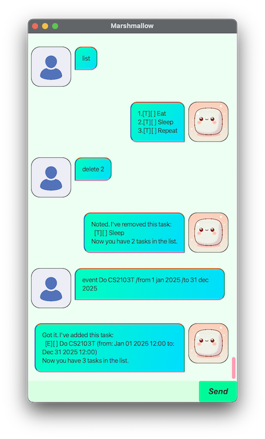

# Marshmallow

### ⚠️
**Disclaimer**

This product is a graded component of the Course **CS2103T Software Engineering** at NUS. Most design decisions found in this product are a result of restrictions imposed or requirements otherwise prescribed by the Course.

#

Marshmallow is a task management tool that keeps you organised, focused, and ready to take on your day. Comes in two flavours - GUI and CLI.

