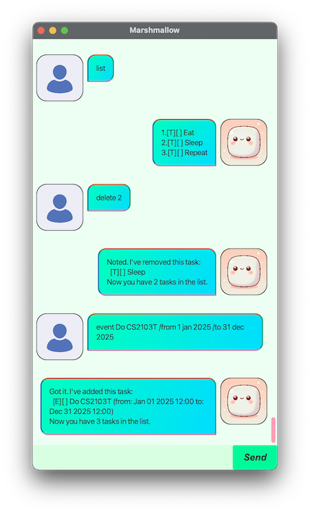

# Marshmallow User Guide



Marshmallow is a task management tool that keeps you organised, focused, and ready to take on your day.

Documented here are a list of commands and their usages that Marshmallow accepts. Where there would be no ambiguity, using some prefix of the command would be sufficient.

## Adding Todos: `todo`

Add a task to do

### Usage
```
todo <description>
```

### Example
```
todo Eat
```

### Expected output
```
Got it. I've added this task:
  [T][ ] Eat
Now you have 2 tasks in the list.
```

## Adding Deadlines: `deadline`

Add a task with a deadline

### Usage
```
deadline <description> /by <date>
```

### Example
```
deadline Do CS2103T /by tomorrow
```

### Expected output
```
Got it. I've added this task:
  [D][ ] Do CS2103T (by: Feb 22 2025 12:00)
Now you have 3 tasks in the list.
```

## Adding Event: `event`

Add a task with a start and end date

### Usage
```
event <description> /from <date> /to <date>
```

### Example
```
event Exams /from Apr 28 /to May 9
```

### Expected output
```
Got it. I've added this task:
  [E][ ] Exams (from: Apr 28 2025 12:00 to: May 09 2025 12:00)
Now you have 4 tasks in the list.
```

## Listing Tasks: `list`

List all tasks

### Usage
```
list
```

### Expected output
```
1.[T][ ] Eat
2.[T][ ] Sleep
3.[T][ ] Repeat
```

## Marking task as done or undone: `mark` or `unmark`

Marks a task as done or undone

### Usage
```
mark <task number>
```

### Example
```
mark 1
```

### Expected output
```
Nice! I've marked this task as done:
  [T][X] Eat
```

## Deleting a task: `delete`

Deletes a task

### Usage
```
delete <task number>
```

### Example
```
delete 2
```

### Expected output
```
Noted. I've removed this task:
  [T][ ] Sleep
Now you have 2 tasks in the list.
```

## Finding a task: `find`

Finds a task

### Usage
```
find <query>
```

### Example
```
find Eat
```

### Expected output
```
Here are the matching tasks in your list:
1.[T][X] Eat
```

## Exiting: `bye`

### Usage
```
bye
```